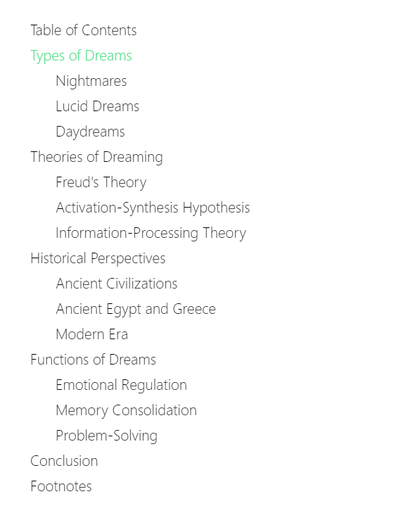
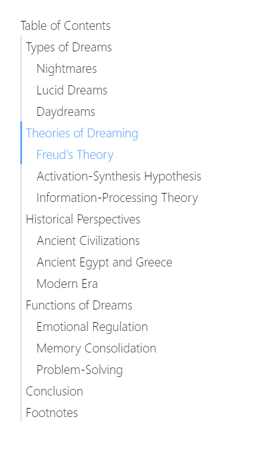
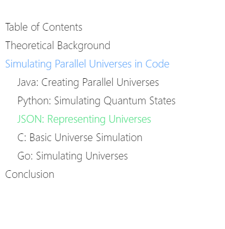

[English](./README.md)

# nuxt-toc

[![npm 版本][npm-version-src]][npm-version-href]
[![npm 下载量][npm-downloads-src]][npm-downloads-href]
[![许可证][license-src]][license-href]
[![Nuxt][nuxt-src]][nuxt-href]

<div align="center">
  
</div>

用于 Nuxt Content 项目中目录（TOC）组件的 Nuxt 模块。

- [✨  发布说明](https://github.com/hanyujie2002/nuxt-toc/releases)

## 特性 ✨

- 🎨 **高度可定制**：根据你的独特需求进行调整。
- 🔍 **当前目录高亮**：轻松查看你所在的章节。
- 📦 **开箱即用**：只需极少的配置即可使用。
- 🔗 **章节链接**：轻松导航。

## 快速开始 🔧

1. 使用以下命令将模块安装到你的 Nuxt 应用程序中：

```bash
npx nuxi module add nuxt-toc
```

2. 在需要目录的地方添加 `<TableOfContents />`。

```vue
<template>
    <ContentDoc />
    <TableOfContents />
</template>
```

## 属性

| **属性**           | **类型** | **默认值** | **描述**                                                                                     |
|--------------------|----------|-------------|-----------------------------------------------------------------------------------------------------|
| `path`             | String   | `''`        | 生成目录的内容路径。**如果未设置，`nuxt-toc` 将默认使用当前 URI 作为路径**。                                    |
| `isSublistShown`   | Boolean  | `true`      | 决定是否显示目录中的子列表。                                             |
| `isTitleShownWithNoContent` | Boolean  | `false`     | 决定在目录中没有内容的情况下是否显示标题。                                  |
| `title`            | String   | `'Table of Contents'` | 目录的标题。                                                                               |

## 样式

| **ID/类**                | **类型** | **描述**                                                                                     |
|-----------------------------|----------|-----------------------------------------------------------------------------------------------------|
| `toc-container`             | ID       | 目录的容器。                                                      |
| `toc-title`                 | ID       | 目录的标题。                                                                 |
| `toc-item`                  | 类    | 目录项的通用类。                                                                        |
| `toc-topitem`               | 类    | 顶级目录项的特定类。                                                             |
| `active-toc-item`           | 类    | 应用于当前目录项。                                                                        |
| `active-toc-topitem`        | 类    | 应用于当前顶级目录项。                                                              |
| `toc-link`                  | 类    | 目录链接的通用类。                                                                        |
| `toc-toplink`               | 类    | 顶级目录链接的特定类。                                                             |
| `active-toc-link`           | 类    | 应用于当前目录链接。                                                                        |
| `active-toc-toplink`        | 类    | 应用于当前顶级目录链接。                                                              |
| `toc-sublist`               | 类    | 目录中子列表的样式。                                                                  |
| `toc-subitem`               | 类    | 子级目录项的特定类。                                                             |
| `active-toc-subitem`        | 类    | 应用于当前子级目录项。                                                              |
| `toc-sublink`               | 类    | 子级目录链接的特定类。                                                             |
| `active-toc-sublink`        | 类    | 应用于当前子级目录链接。                                                              |
| `toc-item-${link.id}`       | ID       | 基于 `link.id` 动态生成的每个目录项的 ID。                                 |
| `toc-topitem-and-sublist`   | 类    | 顶级目录项及其子列表的样式。                                                  |

> [!NOTE]
> `<TableOfContents />` 组件的默认样式是：
>
> ```css
> .active-toc-item {
>   color: #fef08a;
> }
>
> .toc-sublist-item {
>   padding-left: 1rem;
> }
> ```
>
> 你可以自定义样式或重置样式：
>
> ```css
> .active-toc-item {
>   color: inherit;
> }
>
> .toc-sublist-item {
>   padding-left: 0;
> }
> ```

## 示例手册

### 示例一

自定义当前目录项的颜色和子级目录项的内边距。

```vue
<template>
    <ContentDoc />
    <TableOfContents />
</template>

<style>
/* 目录项的样式 */
.active-toc-item {
  color: #4ade80;
}

/* 子级目录项的样式 */
.toc-sublist-item {
  padding-left: 1.5rem;
}
</style>

<!-- 或者使用 Tailwind CSS
<style>
.active-toc-item {
  @apply text-green-300
}

.toc-sublist-item {
  @apply pl-1.5
}
</style>
-->
```

结果：

<div align="center">
  
</div>

### 示例二

在每一个目录项左边有一个条。

```vue
<template>
    <ContentDoc />
    <TableOfContents />
</template>

<style>
.toc-item {
  border-left-width: 2px;
  border-left-style: solid;
  border-left-color: white;
  padding-left: 0.25rem /* 4px */;
}

.active-toc-item {
  color: #60a5fa;
  border-color: #60a5fa;
}

.toc-sublist-item {
  padding-left: 1rem;
}
</style>

<!-- 或者使用 Tailwind CSS
<style>
.toc-item {
  @apply border-l-2 pl-1
}

.active-toc-item {
  @apply text-blue-400 border-blue-400
}

.toc-sublist-item {
  @apply pl-4
}
</style>
-->
```

结果:

<div align="center">
  
</div>

### 示例三

当任意子级目录项处于高亮状态时，顶级目录项也处于高亮状态。

```vue
<template>
    <ContentDoc />
    <TableOfContents />
</template>

<style>
.active-toc-item {
  /* 覆盖内置样式 */
  color: inherit;
}

/* 子级目录项包含在子列表中，而子列表是顶级目录项的兄弟元素 */
.active-toc-item, .toc-topitem:has(+ .toc-sublist .active-toc-sublist-item) {
  color: #60a5fa
}

.active-toc-sublist-item {
  color: #4ade80
}

.toc-sublist-item {
  padding-left: 1rem /* 16px */;
}
</style>

<!-- 或者使用 Tailwind CSS
<style>
.active-toc-item {
  @apply text-inherit
}

.active-toc-item, .toc-topitem:has(+ .toc-sublist .active-toc-sublist-item) {
  @apply text-blue-400
}

.active-toc-sublist-item {
  @apply text-green-400
}

.toc-sublist-item {
  @apply pl-4
}
</style>
-->
```

结果：

<div align="center">
  
</div>

## 许可证

本项目基于 [MIT](https://raw.githubusercontent.com/hanyujie2002/nuxt-toc/refs/heads/main/LICENSE) 许可证。

[npm-version-src]: https://img.shields.io/npm/v/nuxt-toc/latest.svg?style=flat&colorA=020420&colorB=00DC82
[npm-version-href]: https://npmjs.com/package/nuxt-toc

[npm-downloads-src]: https://img.shields.io/npm/dm/nuxt-toc.svg?style=flat&colorA=020420&colorB=00DC82
[npm-downloads-href]: https://npmjs.com/package/nuxt-toc

[license-src]: https://img.shields.io/npm/l/nuxt-toc.svg?style=flat&colorA=020420&colorB=00DC82
[license-href]: https://npmjs.com/package/nuxt-toc

[nuxt-src]: https://img.shields.io/badge/Nuxt-020420?logo=nuxt.js
[nuxt-href]: https://nuxt.com
